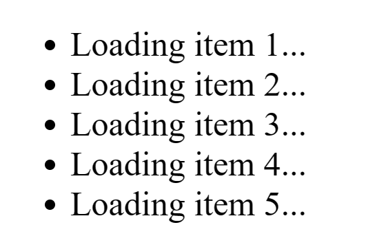

# Streaming HTML for Asynchronous Rendering

***No JavaScript required***

**[Demo site](https://dj-streaming-shadow-dom.cottonash.com/)**.



This repo combines three technologies:

1. Django's StreamingHttpResponse
2. Jinja2 streaming templates
3. The [Declarative](https://developer.mozilla.org/en-US/docs/Web/API/Web_components/Using_shadow_DOM#declaratively_with_html) Shadow DOM [web standard](https://developer.chrome.com/docs/css-ui/declarative-shadow-dom)

This gives us a page that can be immediately rendered by the browser while at the same time waiting for slower parts of the page to be sent by the server...without any JavaScript.

This is useful for when your view has to do some things that might take a while, like querying databases or making API requests. We don't want the user staring at a blank page wondering why the site is broken. One common way of handling this is 
sending preliminary HTML along with JavaScript that will fetch the rest of the data and use that data to build HTML to insert into the page. This repo demonstrates an alternative method.

## How it works
1. User loads the page
2. The server begins composing the HTML, and crucially, begins sending the HTML from the top *as its ready*. It does *NOT* render the whole template and then send it all at once.
3. "Higher up" in the HTML is a *Declarative Shadow Root* which is super fast and easy for the template engine to render. This is a placeholder (for example, the "loading item..." text in the above animation.)
4. At the end of the template, we we render a *Shadow DOM* which contains the content that takes a while to generate. 
5. When the HTML parser in the browser encounters the Shadow DOM content at the end of the document, it projects it into the spot(s) "held open" by the Shadow Root previously rendered.

## What's required?
For a server to implement this technique it has to be able to:

* **Evaluate a template in a streaming manner.** 
* **Send a response in a streaming manner.** In other words it must have a way to send each chunk of HTML as it becomes available over the same connection rather than "all at once". Typically this is used to save memory...imagine sending a client a 
  multi-gigabyte file. You don't want to have to load the whole thing into memory before you start sending it. This is not our reason for using it, we just want to be able to keep the connection open and keep shoving data down it. 

For a client to support this it has to be able to:

* **Understand the Declarative Shadow DOM web standard.** This is supported by all *evergreen* modern browsers. It's a way to include a placeholder in the HTML that will be replaced by the content of a Shadow DOM when it's ready. This is the key to allowing the browser to render the page before the slow parts are ready.

## How does this Django app do it?
The key parts of this are in `streaming/views.py` and `templates/streaming/index.html`. We're using async views, but that's not actually necessary for this technique...I'm just making my public server more efficient. To simulate slow 
generation/fetching of data, I use a function to sleep for a bit of time and this can eat up gunicorn workers without async.

### `views.py`

We use Jinja2 because of its ability to stream templates. While here we manually use Jinja2 to maintain the ability to use Django's templating language in other templates, it's quite possible to just configure Django to use Jinja2 for all of its 
templating.

The key part of the templating part of this technique is located in `content_generator` in the lines:

```python
async for chunk in template.generate_async(delayed_range=delayed_range):
    yield chunk
```

Here the template engine just starts giving us chunks of the rendered template.  

`content_generator` is a generator function which yields chunks. We then pass the iterator it creates to Django's `StreamingHttpResponse` in `shadow_dom_streaming_example` which will send each chunk as it becomes available:

```python
return StreamingHttpResponse(content_generator())
```

### `index.html`

The placeholder Declarative Shadow Root is held in this section of the template:


```html
<template shadowrootmode="open">
  
  <ul>
    
      <li>
        <slot name="item-{{ i }}">Loading item {{ i + 1 }}...</slot>
      </li>
    
  </ul>

</template>
```

This just inserts a handful of `<slot>` elements each with a unique `name` attribute.

And then, at the end of the template, right before the closing `</body>` tag, we render the Shadow DOM:

```html

  <span slot="item-{{ i }}">Content for item {{ i + 1 }}</span>

```

This is where it all comes together!  We use the `delayed_range` function to simulate a slow process. 
The template engine spends a while in this loop. In the real world, you might be calling third party APIs, running some machine learning models, running intensive db queries, etc. As the data becomes available, the template engine gives it to 
Django and Django sends it to the client in the same connection the rest of the HTML was sent.


## Gotchas
* **Reverse proxies may buffer responses**. For example, on the demo server, I had to add `proxy_buffering off;` to the nginx config for the `/` location block. Another solution is to have Django send the `X-Accel-Buffering: no` header.
* **Browser support**. I've tried it on Edge, Chrome, and Firefox. I've been told it works in Safari. These are all evergreen browsers that auto-update. I don't know about other browsers. [Here's caniuse](https://caniuse.com/declarative-shadow-dom) for the Declarative Shadow DOM.

## Improvements
If you have any ideas for improvements either to the code or to the documentation, please open an issue or a pull request.


## Inspiration
I first saw this technique described by [Chris Haynes on his blog here](https://lamplightdev.com/blog/2024/01/10/streaming-html-out-of-order-without-javascript/).
